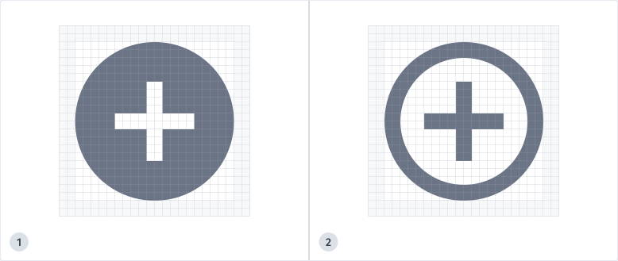

# HERE Icon Library

HERE icons are visual cues of objects, points, actions, and tools found across our products. They are designed to complement our humanist typeface, FiraGo. 
 
The icons cover cases that include general user interface, data, devices, cartographic purposes, turn-by-turn navigation and more.

## Usage

HERE icons are designed to express our brand across our products with principles of simplicity for easy recognition by the masses. We prioritize legibility over consistency and aim for a similar visual weight across all icons.  

## Size

Icons come in three sizes: 
- 24 px 
- 16 px
- 8 px

Note: not all icons exist for the 8px size.  

## Solid and Outline

Icons come as either solid or outline. We recommend use of solid icons as outline icons could lead to eye fatigue and legibility issues.
Many icons share the same geometry for both solid and outline variations, so adding states such as Select/Deselect is not advised. 
Ideally the solid and outline variations have the same outer dimension and corner radius. Details can vary between the two styles in favor of visual optimization. Many icons do not work well in an outline version or can’t be identified as either outline or solid. In such cases, do not force a solid or outline variation; keep the same geometry for both icons.  

## Cartography Icons 
**Solid, 16 px icons in the POI group** are optimized for use with maps and the only icons that should be used in cartographic contexts. These are the icons you can see on HERE maps and represent points of interest (POI) like a particular place in a define location that can be categorized like hospitals, parking garages, and museums.  

## Grouping 
Icons have been grouped in hopes of making it easier to browse.  
 
- **[Core UI](icons/core-ui)**: Commonly used actions and items 
 
- **[Data](icons/data)**: Items, actions, and statuses related to data.  
 
- **[Devices and sensors](icons/devices-sensors)**: Hardware, sensors, and devices 
 
- **[Discovery and sharing](icons/discovery-sharing)**: Actions and items for finding, filtering, and viewing 
 
- **[Guidance icons](icons/guidance-tools)**: Road signs and signals to aid drivers. Created on a grid of 80x80 px with a stroke weight of 6 px. They are difficult to read at 24 px. 
 
- **[Map view](icons/map-view)**: Actions for viewing maps 
 
- **[Miscellaneous](icons/misc)**: Assorted symbols and markers  
 
- **[Navigation Image](icons/navigation-image)**: Miscellaneous controls and tools for media and image editing 
 
- **[POI](icons/poi)**: Points of interest, parking, and activities. Solid variations are specific to cartographic use. 
 
- **[Social](icons/social)**: Commonly used in social media and communication 
 
- **[Stats](icons/stats)**: Items for statistics, charts, and directions 
 
- **[Tools](icons/tools)**: Items and instruments for adjusting, editing, and indicating  
 
- **[Travel, transport and tracking](travel-transport-tracking)**: Items related to traffic, transport, receiving, and logistics 
 
- **[Weather](icons/weather)**: Climate conditions

## License 

Copyright (C) 2017-2021 HERE Europe B.V. 
Unless otherwise noted in “LICENSE” files for specific files or directories, the [LICENSE](LICENSE) in the root applies to all content in this repository. 
